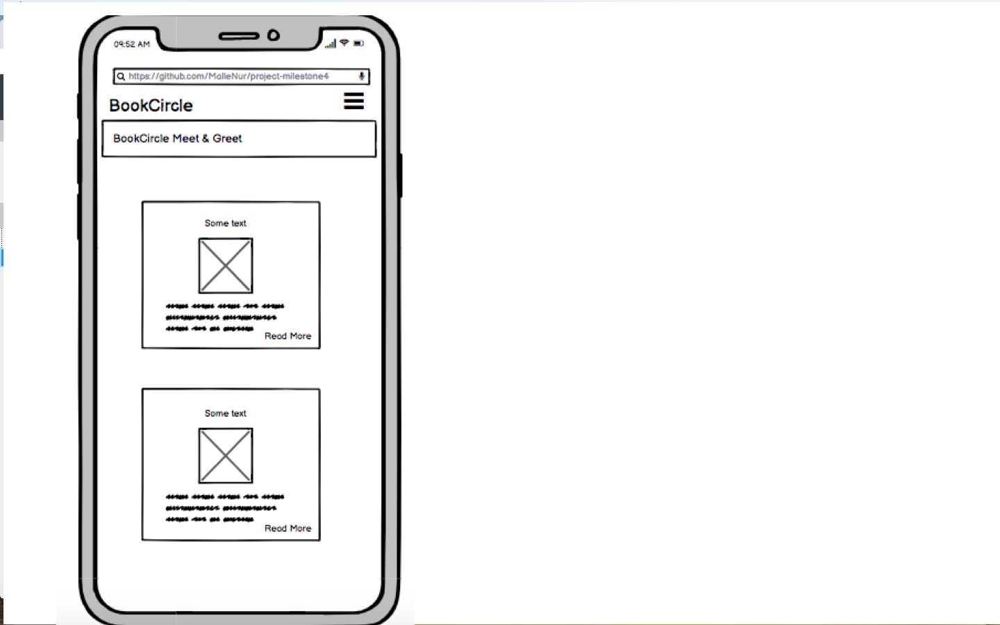

# The Book Circle Project
## A community for book lovers to connect through an interactive social website. 

You can view the live deployed app here.

## Table of Contents
- Project Idea
- User Experience Design (UX)
- Features
- Technologies
- Testing
- Deployment
- Credits

## Project Idea

This is the fourth Portfolio Project (PP4) for the Code Insitute's Full Stack Web Development course.
The PP4 project idea will showcase my ability to design a web application by applying an MVX framework and related technologies. I have also deployed to Heruko as required.

This website is an interactive community for book lovers to either meetup or socialize throught the website to connect and discuss the books assigned for reading through popular vote.

The members can post details of the books to be read, leave comments or suggest new books for the group to read and discuss. The members can also collectively choose which book that will be next on the reading list of suggested books.

## User Experience Design
### User Stories
   ### Strategy Goals
   - Make an website for BookCircle members where they can interact and meet & greet.
   - The website can be read and navigated on both desktop and mobile devices.
   - The website has to permit organisers and members to verify and interact with the content through creating meetup information and post comments. 
   
   ### Book Circle Organiser Goals 
    As a admin:
    - I want to be able to setup and manage the book list
    - I want to be able to create and be in charge of the meetup information page.
    
   ### First Time Visitor Goals 
    As a first time user:
    - I want to be able to navugate the website without problems
    - I want to easily find information about the BookCircle and its social meet & greet.
    - I want to be able to register to become a member of the BookCircle.
    
   ### Returning Visior Goals
    As a returning visitor:
    - I want to be able to see information about previous and next meet & greet.
    - I want to be able to post comments about the meet & greet and book.
    - I want to be able to vote for "book of the month".
    
  ### Design
  
   - Layout
     
     The website has a simple layout where the user can see the logo and site navigation along with a top bar and simple footer on the bottom of the website. A Bootstrap board is used for content to be displayed as a styled section for the main page.
     
   - Content
     
     The site admin will be in charge of creating the content as constructing books and meet & greet items. 
     Details of the books will be displyed below the image on smaller screens and shift to the right of the image on larger screens.
     It will also be the same for the book list as well as the meetup book.
     There will be a default placeholder image shown in place of the user choosing a bookcover image.
     
   - User Input
   
     Data is updated by using Bootstrap forms. For this project i am using either Bootstrap buttons or Fontawsome icons for all user interaction controls.
     
   - Typography
   
     The Google font Roboto was used for this project.
     
   - Imagery
   
     There is no background image needed for this project. BookCircle members have the ability to upload an image of a book cover to draw the user's attention to the meet & greet information. In the absence of a user-uploaded image, a default placeholder image of an untitled book cover is used. 
     
   - Wireframes
   
    Desktop Wireframes:
    
    Homepage
    https://share.balsamiq.com/c/aRtgea7mQak2fjD1P1sr7J.png
    
    Our Library
    https://share.balsamiq.com/c/dxidnYK2irmfbXjMBsU2Vb.png
    
    About Us
    https://share.balsamiq.com/c/2TyAPPqaLsE4Nwm8jQ9A6U.png
    
    Sign Up
    https://share.balsamiq.com/c/f3ACVJPs1NUMpMJ7f6bafQ.png
    
    Sign In
    https://share.balsamiq.com/c/4RdMLbp5hMZZS22Dv2N3Ld.png
    
    
    Mobile Wireframes:
    
    Homepage
    
    
    Our Library
    https://share.balsamiq.com/c/7ymWom9wuYCcjkU5QQsRsG.png
    
    About Us
    https://share.balsamiq.com/c/sK5jHPgRfqNaGDfp21Nwb2.png
    
    Sign Up
    https://share.balsamiq.com/c/2qQWRrgxXAvPDrD5BgC1Mr.png
    
    Sign In
    https://share.balsamiq.com/c/8edK8GMY3fpoKeFbjWNSHZ.png
    
  ### Django Modell ERD
  
 [Blankdiagram.pdf](https://github.com/MalleNur/project-milestone4/files/9447060/Blankdiagram.pdf)
 
 ## Features

To have a functioning website the following features was needed to be inplemented to fulfil the sites needs:

- <strong>Simple navigation menu</strong> is always visible at the top of the screen. The user can see the previous books, meet up, sign in and Login/Logout that is clearly highlighted on the menu navigation bar. 
- <strong>Meetup cards</strong> tells the user of the upcoming and past bookcircle events. The user only needs to click on the card to be taken to the Meetup Details page.
- <strong>Meetup Details page</strong> displays much more information about the month's book and the organiser's message.
- <strong>Option to leave a comment</strong> is for the logged in memebers and the administrator thats in charge of the website. The memebers will be able to to comment and start/engage in discussions with other bookcircle members about the books etc. Members have option to delete their own comments. 
Note that when users are not logged in the 'Leave a comment' option is replaced with a 'Login to join the discussion' call-to-action.
- <strong>System Messages</strong> notify the user upon login/logout

### Future Features

- Allow members to rate books by clicking a visual '5-stars' control
- Automate closing the vote for next month's book and posting a message to the site
- Automate generating posting the next month's meetup based on the third Tuesday of each month
- Allow members to reply in-thread to individual comments to create conversations
- Allow members to post their own book reviews

## Technologies Used 

### Languages Used:

Python 3.6+ with the Django web framework

### Frameworks, Libraries & Programs Used
1. <stong>Git</strong> was used for version control and managed via the VSCode terminal to commit to Git and push to GitHub.
2. <strong>GitHub</strong> was used to store the project's code after being pushed from Git
3. <strong>Flake8</strong> linter extension for VScode
4. <strong>Heroku</strong> was used to deploy the app
5. <strong>LucidChart</strong> was used to create the logic flowchart
6. <strong>Bootstrap 4</strong> front-end CSS toolkit
7. <strong>Font Awesome 6</strong> font and icon toolkit
8. <strong>pgAdmin</strong> Postgres database GUI Tool used to generate the ERD

## Testing
All testing and code validation is in the readme-documents in the repositry. 

## Bugs

1. TypeErrors where solved
2. OperationalErrors where solved by migrations
3. static assets where routed correctly by setting it up with cloudinary - as we have used ImageFields which are served from cloudinary
4. Url patterns and templates where routed correctly
5. packages were installed correctly

## Deployment

### Requirements

- Python >=3.7, Django 3.2
- The following third party packages were installed using pip install <package_name> (listed below in order of installation). The full list of required dependencies, with version numbers, is in the requirements.txt file. 

python-dotenv
Django
gunicorn
dj_database_url
psycopg2
dj3-cloudinary-storage
django-allauth
django-crispy-forms

- Heroku Procfile requires the following content:

web: gunicorn bookcircle.wsgi:application

- Initial deployment on any platform requires the creation of an admin 'superuser' to allow the site owner access to the backend admin control panel. At the Zsh/Bash shell (aka terminal/cli/console/command prompt) run the following command:

python3 manage.py createsuperuser
or
<strong>python manage.py runserver and open port 8000 in browser.</strong>

## Heroku

The Project repository (repo) is at https://github.com/MalleNur/

Deployment of the site to Heroku was done as follows:

1. Login to your Heroku account
2. Create a New App
3. (Important!) Select the 'Settings' tab first
4. Select 'Add Buildpack' and select Python
5. Add the database in the 'Resources' tab > Add-ons, select Heroku Postgres
6. In 'Settings' click on 'Reveal Config Vars'
7. Add any relevant config vars by entering the KEY/VALUE pair data, e.g. PORT & 8000. The required vars are shown in the .env_template file in the project repo
8. Select the 'Deploy' tab
9. For the Deplyoment Method select GitHub
10. Connect to GitHub repo by entering YOUR-REPO-NAME, then Connect
11. A message will confirm that your app was successfuly deployed
12. Test that the site has successfully gone live by clicking on the 'View' button
13. Your app can now be accessed via any browser at: https://YOUR-APP-NAME.herokuapp.com

## Acknowledgements

- My mentor Narender Singh that have helped me with this project. Thaks alot!
- The Code Institute Community on Slack and the CI staff and students for their feedback and support. 
